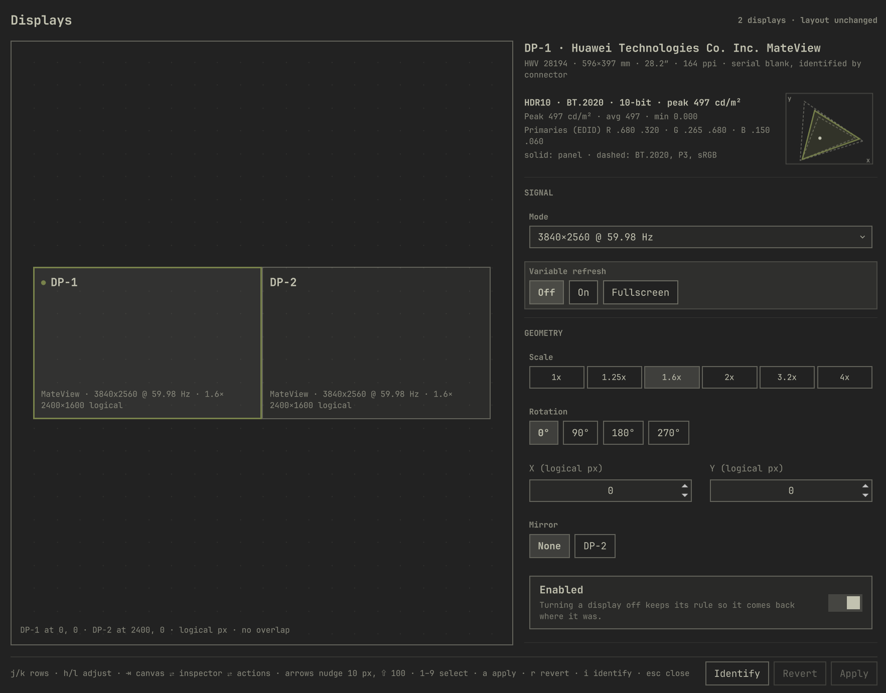
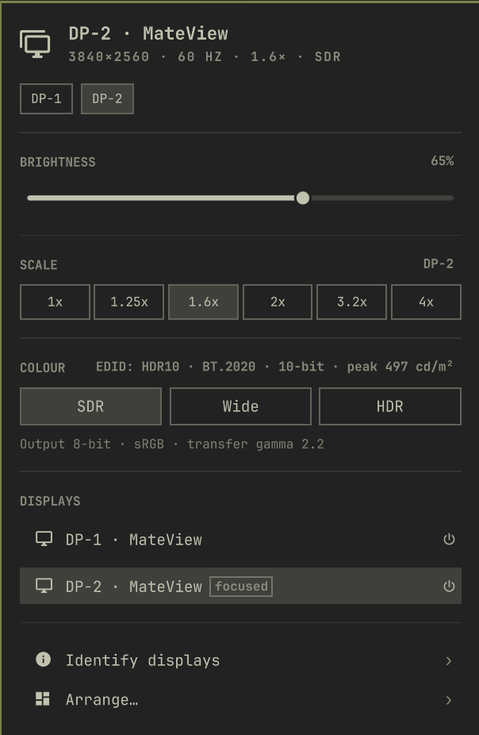

# Displays for Omarchy

Arrange displays, drive them at their real capabilities, and switch colour
modes (SDR, wide gamut, HDR) with a safe apply and revert. An Omarchy shell
plugin for Hyprland 0.56+ with the Lua config.

Two surfaces, one backend:

- **Popup** in the bar: brightness, SDR white while in HDR, scale, one
  `SDR · Wide · HDR` control gated by the panel's EDID, the display list,
  Identify and Arrange.
- **Studio** overlay: arrangement canvas in logical pixels with snapping, an
  inspector for signal, geometry and colour (mode, refresh, VRR, scale,
  rotation, position, mirror, enable, colour mode, SDR white, SDR transfer,
  ICC profile) and an Advanced section (colour preset, mastering luminances,
  capability overrides, auto-HDR).

Every risky change is applied live and **reverts itself in 15 seconds unless
kept**. The timer runs outside the shell, so a shell crash still reverts.

The design and the reasoning behind it live in [DESIGN.md](DESIGN.md).

## What it looks like

The studio: arrangement canvas on the left, inspector on the right, keyboard
hints and the apply bar along the bottom. The gamut plot draws the panel's
EDID primaries (solid) against BT.2020, P3 and sRGB (dashed).



The bar popup, for what you change often. `SDR · Wide · HDR` is gated by what
the panel actually reports, and the line under it says what the compositor is
doing right now rather than what was asked for.



## Install

```bash
git clone <this repo> ~/.config/omarchy/plugins/pmotta.displays
omarchy-shell shell rescanPlugins
omarchy plugin enable pmotta.displays
```

The bar widget lands in the right section. Optional keybindings, in
`~/.config/hypr/bindings.lua`:

```lua
o.bind("SUPER + CTRL + D", "Displays", "omarchy-shell pmotta.displays popup")   -- replaces the built-in Display popup
o.bind("SUPER + CTRL + SHIFT + D", "Displays studio", "omarchy-shell shell toggle pmotta.displays")
```

To make **Setup › Monitors** open the studio instead of the config editor, add
to `~/.config/omarchy/extensions/omarchy-menu.jsonc` (it hot-reloads):

```jsonc
"setup.monitors": {"icon":"󰍹","label":"Monitors","action":"omarchy-shell shell toggle pmotta.displays"},
```

Requirements already present on Omarchy: `hyprctl`, `jq`, `edid-decode`
(v4l-utils), `ddcutil`/`brightnessctl` through `omarchy-brightness-display`,
`socat`, `systemd-run`.

## Keys

| Key | Popup | Studio |
|---|---|---|
| j / k, ↓ / ↑ | next / previous row | next / previous inspector row |
| h / l, ← / → | adjust slider, walk pills | adjust the current row; on the canvas nudge 10 px (⇧ 100) |
| Tab | switch bar panel | canvas ⇄ inspector ⇄ actions |
| 1–9 | — | select display |
| Enter | select the display under the cursor; on the display already selected, its power | activate row / open dropdown / focus a number field |
| a / r / i | — | Apply / Revert or Discard / Identify |
| Esc | close | cancel a pending countdown, then close |

Mouse hover moves the same cursor; there is never a second highlight.

Clicking a display in the popup's list selects it. Switching one **off** is the
one action that will not happen on a single press: the power control at the end
of the row arms first and says `turn off?`, and a second press within four
seconds carries it out. Moving off the row, or letting the window lapse, puts
the safety back on. Switching a display on is immediate, and the last enabled
display cannot be switched off at all. In the studio, `Enabled` stages the
change like every other field and needs `a` to apply.

## Command line

Everything the UI does is a subcommand of `bin/omarchy-displays`:

```
omarchy-displays state                          # JSON: displays, EDID capabilities, live + kept config, pending
omarchy-displays hdr on|off|wide [--display DP-2] [--sdr-white 203] [--now]
omarchy-displays apply [--now] '{"displays":[{"name":"DP-2","scale":2}]}'
omarchy-displays keep | revert | persist
omarchy-displays brightness DP-2 [+5%|5%-|40%]
omarchy-displays identify | open
omarchy-displays edid DP-2
omarchy-displays icc list
```

Change JSON accepts, per display: `mode`, `position`, `scale`, `transform`,
`vrr`, `enabled`, `mirror`, `bitdepth`, `cm`, `sdr_eotf`, `sdrbrightness`,
`sdrsaturation`, `sdr_min_luminance`, `sdr_max_luminance`, `min_luminance`,
`max_luminance`, `max_avg_luminance`, `icc`, `supports_hdr`,
`supports_wide_color`; and `global.cm_auto_hdr`. Everything is validated
against what `hl.monitor` accepts before anything is written.

## How it persists

- `~/.local/state/omarchy/displays/intent.json` — what you chose, per connector.
- `~/.local/state/omarchy/displays/pending.json` — an applied-but-not-kept change with its expiry.
- `~/.local/state/omarchy/toggles/hypr/displays-layout.lua` — generated from
  intent plus live geometry. Omarchy loads every file in that directory after
  your own `~/.config/hypr/monitors.lua`, so these rules win, and your file is
  never parsed or edited. Every connected display gets a full rule: mixing an
  explicit position with Hyprland's auto placement moves displays.

`hyprctl reload` restores the kept configuration; that is the revert primitive.

## Colour model

| Mode | bitdepth | cm | also written |
|---|---|---|---|
| SDR | 8 | `srgb` | — |
| Wide | 10 | `auto` (→ wide when supported) | — |
| HDR | 10 | `hdr` (`hdredid` via Advanced) | `sdr_max_luminance` = SDR white, default 203 cd/m² (BT.2408) clamped to the panel's max-average luminance; `sdr_min_luminance` from EDID or 0.2 |

Hyprland's own default for SDR white in HDR mode is 80 cd/m², which is why
HDR desktops look washed out. This tool always writes it on HDR entry.

## Development

```bash
./test/all               # bash tests (sandboxed fake hyprctl + EDID fixture) and node tests for Model.js
omarchy-restart-shell    # after editing QML; a symlinked plugin is not hot-reloaded
journalctl --user -t omarchy-shell -f   # QML warnings and errors
```

Layout:

```
manifest.json      kinds: bar-widget (Popup.qml), overlay (Studio.qml), service (Service.qml)
Model.js           pure logic shared by QML and tests
components/        ApplyBar, DisplayCanvas, GamutPlot
bin/               omarchy-displays, omarchy-displays-edid
test/              all, *-test.sh, model.test.js, fixtures/
design/            the visual design review (HTML, real theme tokens)
```

## Licence

MIT, the same as Omarchy itself, so the code can move upstream without a
licensing question if it ever earns a place there.
