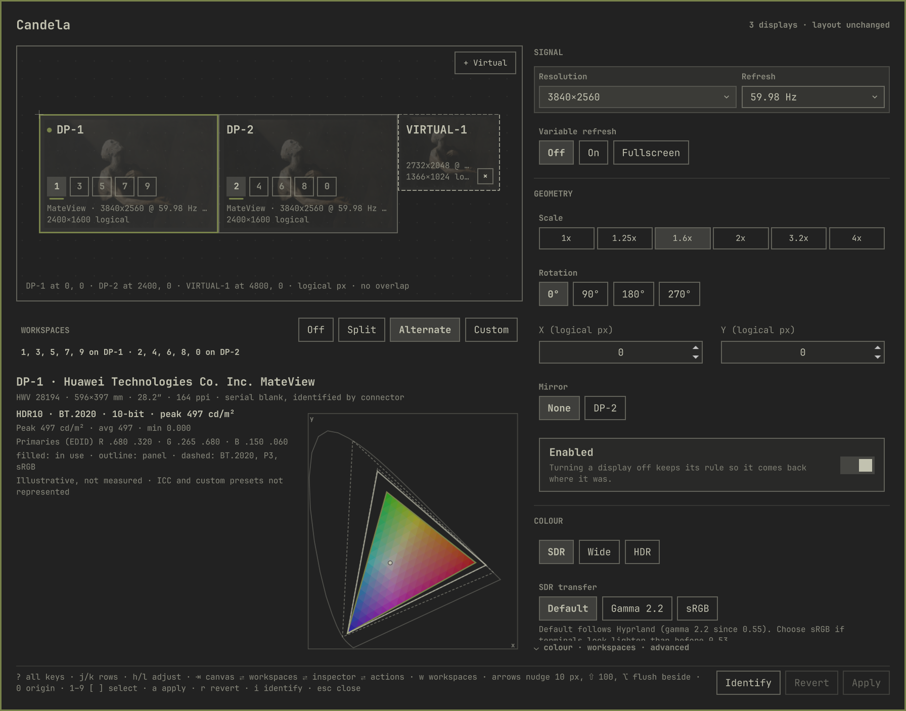
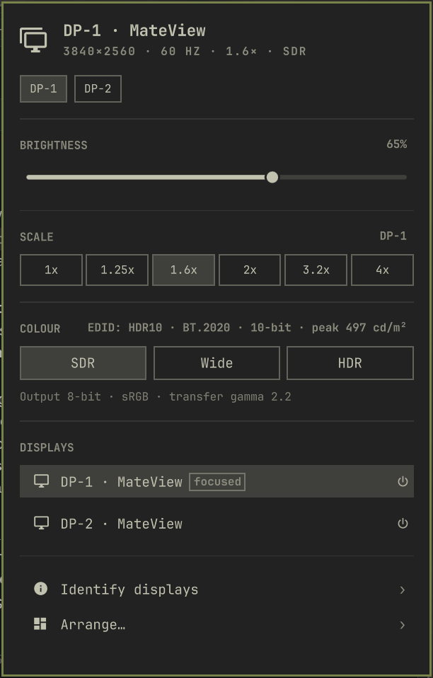
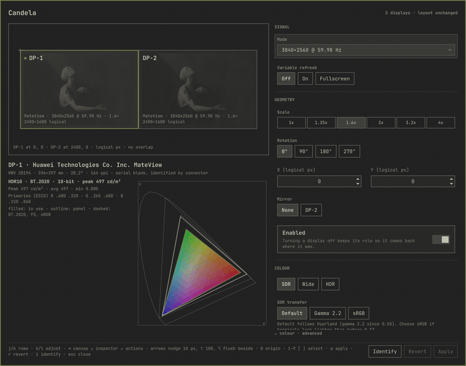
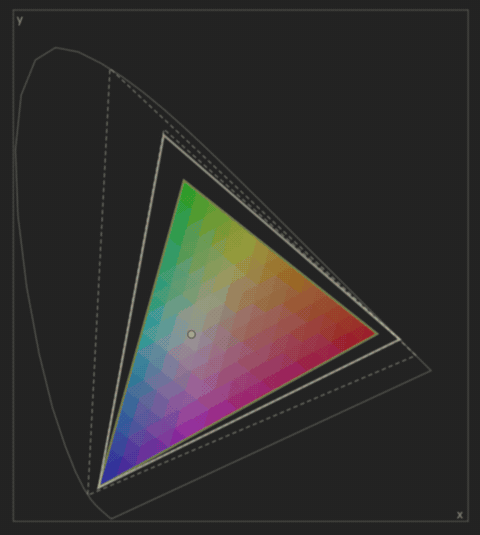
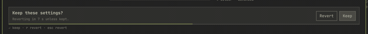

# Candela

Arrange displays, drive them at their real capabilities, and switch colour
modes (SDR, wide gamut, HDR) with a safe apply and revert. An Omarchy shell
plugin for Hyprland 0.56+ with the Lua config.

Two surfaces, one backend:

- **Popup** in the bar: brightness, SDR white while in HDR, text size,
  scale, one `SDR · Wide · HDR` control gated by the panel's EDID, the
  display list, Identify and Arrange. The bar icon itself takes the urgent colour while a
  change is waiting to be kept, and the accent while any display is in HDR, so
  neither needs the popup open to be seen.
- **Studio** overlay: arrangement canvas in logical pixels with snapping, the
  panel's identity and CIE gamut plot beneath it, an inspector for signal,
  geometry and colour (mode, refresh, VRR, scale, rotation, position, mirror,
  enable, colour mode, SDR white, SDR transfer, ICC profile) and an Advanced
  section (colour preset, mastering luminances, capability overrides,
  auto-HDR). A column that runs past its bottom edge says what is below it
  rather than hiding it behind a scrollbar that only appears once you scroll.
- **Virtual displays**: add a display that exists only in Hyprland, as an
  extra screen for a tablet, a fixed-size stage to share or record, or a test
  bench at a size you don't have, and see it in a window here or from another
  device. See [Virtual displays](#virtual-displays).
- **Workspaces**, in the same studio: give each of Omarchy's ten workspaces a
  home display. SUPER+6 then opens workspace 6 on the display you chose, a
  display that connects takes its workspaces back, and the plan survives a
  reboot. See [Workspaces](#workspaces).

Every risky change is applied live and **reverts itself in 15 seconds unless
kept**. The timer runs outside the shell, so a shell crash still reverts. The
compositor is read back after every apply, so a change Hyprland accepted but
did not land on is undone rather than shown as pending. A Keep/Revert strip
sits on every screen while a change is pending, so the decision is never
stranded on a display the change just switched off.

The design and the reasoning behind it live in [DESIGN.md](DESIGN.md).

## What it looks like

The studio: arrangement canvas top left, the panel's identity and its gamut
underneath, the inspector on the right, keyboard hints and the apply bar along
the bottom. The blocks on the canvas carry your own wallpaper, so the
arrangement is a picture of the desk rather than a diagram of it.



The bar popup, for what you change often. `SDR · Wide · HDR` is gated by what
the panel actually reports, and the line under it says what the compositor is
doing right now rather than what was asked for.



### It follows your theme

Every colour, spacing value, font size and corner radius comes from the theme
tokens the shell already publishes — there is not one hardcoded colour in the
plugin. Switch themes and both surfaces switch with them, wallpaper in the
canvas blocks included, light themes as well as dark.



The one thing that does not follow the theme is the chromaticity fill in the
gamut plot. Those colours are the measurement, not the decoration.

Motion follows Hyprland: with its animations turned off
(`animations:enabled`), the popup, the studio, the countdown and Identify
change without animating too.

### The gamut you are actually using

The plot is a CIE 1931 chromaticity diagram: the spectral locus for context,
BT.2020, DCI-P3 and sRGB dashed for reference, the panel's own EDID primaries
outlined, and the gamut **in use** filled in — sRGB while the output is clamped
to sRGB, the panel's own once wide gamut or HDR opens the container. Choosing a
mode tweens between them, from the draft, before anything is applied, so you
can see the headroom before you take it.



Fill colours are approximate by construction: a chromaticity is converted to
sRGB and out-of-gamut components are lifted by adding white rather than clipped
to black. No display can show its own out-of-gamut colours, this one included.

### Apply, then decide

Every risky change applies live and reverts itself unless kept. The countdown
is a rule along the strip's own bottom edge, and under five seconds it and the
caption go urgent — nothing speeds up, so it warns without flapping.



### Which screen is which

`Identify` names every connector on its own screen, one screen at a time 60 ms
apart, with an accent frame at each screen's edge for the one you are looking
at from across the room.


## Install

```bash
omarchy plugin add https://github.com/PushMotta/omarchy-candela.git --enable
```

That clones the repo into `~/.config/omarchy/plugins/io.github.pushmotta.candela`, validates
the manifest, and enables the plugin over IPC. Nothing is executed from the
repo during install, no hook runs, and no sudo is needed. Without `--enable`
it asks first, so you can read the code before switching it on. To develop
against a checkout instead, symlink the checkout to that same path and run
`omarchy-shell shell rescanPlugins`.

Update with `omarchy plugin update io.github.pushmotta.candela`; it shows the diff before
applying it.

The bar widget lands in the right section. Optional keybindings, in
`~/.config/hypr/bindings.lua`:

```lua
o.bind("SUPER + CTRL + D", "Candela", "omarchy-shell io.github.pushmotta.candela popup")   -- replaces the built-in Display popup
o.bind("SUPER + CTRL + SHIFT + D", "Candela studio", "omarchy-shell shell toggle io.github.pushmotta.candela")
```

To make **Setup › Monitors** open the studio instead of the config editor, add
to `~/.config/omarchy/extensions/omarchy-menu.jsonc` (it hot-reloads):

```jsonc
"setup.monitors": {"icon":"󰍹","label":"Monitors","action":"omarchy-shell shell toggle io.github.pushmotta.candela"},
```

Requirements already present on Omarchy: `hyprctl`, `jq`, `edid-decode`
(v4l-utils), `ddcutil`/`brightnessctl` through `omarchy-brightness-display`,
`socat`, `systemd-run`. Nothing else is downloaded or installed. The plugin
runs as your user and asks for no privileges; the one system service it
touches is a transient `systemd --user` timer for its own revert countdown.

## Remove

```bash
omarchy plugin disable io.github.pushmotta.candela
omarchy plugin remove io.github.pushmotta.candela
```

`remove` deletes the git checkout (or unlinks a symlink). It does not touch
what the plugin wrote for you, so that your display layout survives a
reinstall. To go back to a stock machine, also:

```bash
rm -rf ~/.local/state/omarchy/candela                           # intent and pending state
rm -f  ~/.local/state/omarchy/toggles/hypr/candela-{layout,pending}.lua    # the generated rules
hyprctl reload                                                   # back to your own monitors.lua
```

`internal-monitor-disable.lua` and `internal-monitor-scale` in that directory
are Omarchy's own files; this plugin writes them on Omarchy's behalf and
Omarchy's tools keep understanding them after it is gone.

and drop the optional `setup.monitors` override and keybindings above if you
added them. No file outside those paths is ever written.

## Keys

| Key | Popup | Studio |
|---|---|---|
| j / k, ↓ / ↑ | next / previous row | next / previous inspector row |
| h / l, ← / → | adjust slider, walk pills | adjust the current row; on the canvas nudge 10 px (⇧ 100) |
| Tab | switch bar panel | canvas ⇄ workspaces ⇄ inspector ⇄ actions |
| w | — | the workspace plan, under the canvas |
| + | — | add a virtual display |
| 1–9 | — | select display |
| [ / ] | — | previous / next display |
| ⌥ + arrows | — | on the canvas: flush against the nearest display on that side, centred |
| 0 | — | on the canvas: move to the origin |
| Enter | select the display under the cursor; on the display already selected, its power | activate row / open dropdown / focus a number field |
| a / r / i | — | Apply / Revert or Discard / Identify |
| ⌫ | — | put the current row back to what is kept; on the canvas, the display's position |
| ? | — | every key, on one sheet |
| Esc | close | cancel a pending countdown, then close |

A row that the draft changes carries an accent mark in its left margin.
Clicking the mark does what ⌫ does, so a draft can be taken back one field at
a time instead of all at once.

Mouse hover moves the same cursor; there is never a second highlight.

While a change is pending, a Keep/Revert strip sits at the top of every screen
that is not already showing one in the popup or the studio. When neither is
open, the strip on the focused screen has the keyboard: ↵ acts on the
highlighted button (Keep by default), esc reverts, h/l choose. The strip
belongs to the service rather than to a window, so it survives the change
taking away the screen it was made from, and it appears for changes made from
the command line too.

On the canvas, a display dropped on top of another lands flush against the
nearest clear edge instead of overlapping. Changing a display's mode, scale or
rotation moves the displays that sat flush against its old right or bottom
edge by the difference, so a flush layout stays flush.

Clicking a display in the popup's list selects it. Switching one **off** is the
one action that will not happen on a single press: the power control at the end
of the row arms first and says `turn off?`, and a second press within four
seconds carries it out. Moving off the row, or letting the window lapse, puts
the safety back on. Switching a display on is immediate, and the last enabled
display cannot be switched off at all. In the studio, `Enabled` stages the
change like every other field and needs `a` to apply.

## Workspaces

Omarchy opens a workspace on whichever display has focus. In the studio, the
Workspaces strip under the canvas gives each workspace from 1 to 10 a home
display instead (`w` goes straight to it):

- **Plan**: `Off` (the default: nothing is written and nothing moves),
  `Split` (contiguous runs, left to right: 1–5 and 6–0 on two displays),
  `Alternate` (odd and even), or `Custom` (any other arrangement). The line
  under it reads the plan back, display by display.
- **Chips** on each block of the canvas: with a plan, the workspaces that live
  on that display; with none, the ones that are open there now. Dragging a
  chip to another block gives it that home.
- **Lives on** and **Shows when it lights up**, in the inspector for the
  selected display: one pill per workspace, numbered as on the keyboard (↵ or
  a click makes this display its home, or clears it), and the workspace the
  display shows when it connects or is switched on, by default its
  lowest-numbered one.

What it does, as Hyprland 0.56 behaves:

- A workspace with a home is created there, so SUPER+N opens on that display
  and focus goes with it.
- When any display connects, every workspace with a home on a connected
  display goes back to it. A workspace you moved by hand with
  SUPER+SHIFT+ALT+arrows stays until then.
- A display that is unplugged or switched off hands its workspaces to another
  display (Hyprland picks the first one that connected); they come back with it.
  Its homes stay in the plan while it is gone.
- A mirror shows another display's picture, so it cannot be a home. Setting
  one moves its homes to the display it mirrors in the same change.

A reload does not move workspaces that are already open, so applying a plan
moves them itself, and the inspector names every move before you apply.
Nothing in a plan can blank a screen, so a change that only touches the plan
is kept at once, without the countdown; `r` or Revert undoes it, moving the
workspaces back to where they were. A change that also touches a display keeps
its countdown for everything.

The rules are written into the layout file below with the same workspace text
Omarchy's per-workspace layout toggle uses (`"3"`). Hyprland merges rules with
the same workspace text field by field, so SUPER+L's layout and the plan's
display live in one rule and neither undoes the other. Names, icons, apps per
workspace and the bar's workspace widget are left alone.

## Virtual displays

`+ Virtual` on the canvas (or `+`) asks what the display is for and starts
from there; everything stays editable afterwards.

| For | Starts as | Placed |
|---|---|---|
| Extra screen | 2732×2048 at 2× (an iPad Pro 12.9″) | beside your rightmost display |
| Stage | 1920×1080 at 1× | apart |
| Test bench | 1366×768 at 1× | beside your displays |

**Beside** means flush against a real display, so the pointer and windows
cross to it like any neighbour. **Apart** leaves a gap the pointer cannot
cross, so nothing wanders onto a screen you are not looking at; windows get
there through the workspace plan or SUPER+SHIFT+number. Each virtual display
opens on a named workspace of its own (its label, like `stage`), so
workspaces 1 to 0 stay yours. Size, refresh, scale and position change like
any display's, at once and without the countdown, since none of it can blank
a real screen; `r` undoes the last change. It has no EDID, so it is SDR only.
Hyprland forgets virtual displays when it restarts; Candela recreates them
when the shell starts.

You see a virtual display in two ways:

- **In a window on this desk**: Candela's own live picture of it, drawn by
  the shell. Nothing to install and nothing on the network. It is for
  watching; to work in a virtual display, place it beside your displays and
  move the pointer onto it, with the window showing you where you are.
- **On the network**, through [wayvnc](https://github.com/any1/wayvnc), the
  one package this needs: the inspector's *Install wayvnc* opens a terminal
  with Omarchy's own installer. A server on one LAN address you choose, never
  every interface, behind the username `candela` and a generated password,
  with RSA-AES encryption and a key Candela keeps so its fingerprint does
  not change. TigerVNC, bVNC on Android and RealVNC connect; macOS Screen
  Sharing can only connect unencrypted, so it is turned away (TigerVNC on the
  Mac works). It is off after each login unless you ask for it at login. The
  inspector shows who is connected and can disconnect them. Hyprland has one
  cursor, and a viewer's input moves it, so a display placed apart is
  watch-only over the network: input there could leave your pointer on a
  screen you cannot see, out of the mouse's reach. Placed beside, viewers can
  use it.
- **In a call**: the screen-share picker lists virtual displays like any
  other, so a stage is shared by choosing it there.

A network viewer shares your keyboard focus: Super shortcuts typed on a tablet act on
the whole desktop, and locking the session locks the virtual display too.
Removing a virtual display stops its viewers before the output goes, because
wayvnc would otherwise carry on with a real display. If a real display is
unplugged and Hyprland parks its workspaces on a virtual one, Candela moves
them to a real display at once.

## Command line

Everything the UI does is a subcommand of `bin/omarchy-candela`. It is not
on your PATH by itself; the popup, the studio and the revert timer call it by
its full path. To use it from a terminal, link it once:

```bash
ln -s ~/.config/omarchy/plugins/io.github.pushmotta.candela/bin/omarchy-candela ~/.local/bin/
```

```
omarchy-candela state                          # JSON: displays, EDID capabilities, live + kept config, pending
omarchy-candela hdr on|off|wide [--display DP-2] [--sdr-white 203] [--now]
omarchy-candela apply [--now] '{"displays":[{"name":"DP-2","scale":2}]}'
omarchy-candela keep | revert | persist
omarchy-candela revert --expired --token <t>   # the timer's form; does nothing unless <t> still matches pending
omarchy-candela brightness DP-2 [+5%|5%-|40%]
omarchy-candela identify | open
omarchy-candela edid DP-2
omarchy-candela icc list
omarchy-candela recover                        # every display off? switch the built-in (or first) one back on
omarchy-candela doctor                         # is the layout loaded, does the compositor agree, what could fight it
omarchy-candela report                         # diagnostics for a bug report, as Markdown, safe to paste in public
omarchy-candela apply '{"workspaces":{"homes":{"6":"DP-2","7":"DP-2"}}}'   # kept at once; revert undoes it
omarchy-candela apply '{"workspaces":null}'    # plan off: rules removed, nothing moved
omarchy-candela workspaces home                # send open workspaces home, bindable
omarchy-candela virtual add stage|extra|bench [--size 1920x1080] [--scale 1] [--beside DP-2|--apart] [--label Stage]
omarchy-candela virtual view VIRTUAL-1 window on|off
omarchy-candela virtual view VIRTUAL-1 network on|off [--address 192.168.1.89] [--port 5901] [--at-login yes|no]
omarchy-candela virtual secret VIRTUAL-1         # the username and password, as JSON
omarchy-candela virtual remove VIRTUAL-1
omarchy-candela virtual install                  # wayvnc, through Omarchy's installer, in a terminal
```

Change JSON accepts, per display: `mode`, `position`, `scale`, `transform`,
`vrr`, `enabled`, `mirror`, `bitdepth`, `cm`, `sdr_eotf`, `sdrbrightness`,
`sdrsaturation`, `sdr_min_luminance`, `sdr_max_luminance`, `min_luminance`,
`max_luminance`, `max_avg_luminance`, `icc`, `supports_hdr`,
`supports_wide_color`; `global.cm_auto_hdr`; and `workspaces`, with `homes`
(workspace `"1"`–`"10"` → display) and `shows` (display → workspace), where
`null` removes an entry and `"workspaces":null` turns the plan off. Everything is validated
against what `hl.monitor` accepts before anything is written, unknown keys are
rejected at every level, and two rules hold on the merged result rather than
just the change: an ICC profile and an HDR preset cannot coexist, and an HDR
preset is refused while `supports_hdr` is forced off (`-1`).

A field set to `null` is cleared from the intent: the display then keeps
whatever it is doing at that moment, and the next keep pins that into the
layout file, so clearing `mode` does not return a display to its preferred
mode. Set the mode you want instead.

## How it persists

- `~/.local/state/omarchy/candela/intent.json` — what you chose, per connector,
  and the workspace plan.
- `~/.local/state/omarchy/candela/undo.json` — what the last change kept at
  once (the workspace plan, a virtual display) replaced, until anything else
  is applied.
- `~/.local/state/omarchy/candela/virtual/<name>/` (0700) — for network
  viewing, a virtual display's wayvnc config, RSA key and password (0600).
  Removing the display deletes it.
- `~/.local/state/omarchy/candela/pending.json` — an applied-but-not-kept change with its expiry and transaction token.
- `~/.local/state/omarchy/toggles/hypr/candela-pending.lua` — the pending
  change in the same form as the layout, loaded after it, for as long as the
  change is pending.
- `~/.local/state/omarchy/toggles/hypr/candela-layout.lua` — generated from
  intent plus live geometry. Omarchy loads every file in that directory after
  your own `~/.config/hypr/monitors.lua`, so these rules win, and your file is
  never parsed or edited. Every connected display gets a full rule: mixing an
  explicit position with Hyprland's auto placement moves displays. A display
  that is not connected keeps the rule it last had, word for word, so it comes
  back the way you left it rather than at Hyprland's defaults; `doctor` lists
  those. The workspace plan follows the monitor rules.

`hyprctl reload` restores the kept configuration; that is the revert primitive.
Because the pending change is on disk too, loaded after the layout, a reload
from anywhere else during the window (a theme change, Omarchy's clamshell
script reacting to a lid or monitor event) re-applies the preview instead of
silently undoing it. Revert deletes that file and reloads.

`apply` is ordered so that a change is never live without a revert already
armed: it takes a lock, writes the pending file with a transaction token, arms
the timer bound to that token, and only then applies through `hyprctl eval`.
If Hyprland rejects any part of the chunk, apply unwinds on the spot and reports
the rejection. A timer whose token no longer matches the pending file does
nothing, so a stale one can never revert a newer change. After the chunk is
accepted, apply reads the compositor back for up to three seconds and undoes
a change Hyprland did not land on, naming the field. `keep` and `apply --now`
reload, check `hyprctl configerrors`, ask Hyprland whether the layout file
actually ran (the file sets a global for exactly this question; `doctor` asks
it too), and read the displays back once more. While a preview is pending,
`apply --now` joins it instead of keeping: the change shows at once and waits
for Keep with the rest, so an immediate change can never silently confirm
fields that are still awaiting a decision.

A display that is switched off keeps its mode, position and scale in intent,
so it comes back where it was. Should every display ever be off, for instance
a kept layout with one display off booted without the other attached, the
service runs `recover`, which switches the built-in panel, or the first
display, back on. Hyprland draws to an invisible output named `FALLBACK`
while no real display is on; Candela never counts it as a display.

## The built-in panel

A laptop's built-in panel is switched off through Omarchy's own toggle, the
`internal-monitor-disable.lua` file that its clamshell script honours and its
recovery service clears at boot when nothing else is connected, never through
a rule of ours: that script would re-enable a plainly disabled panel within
seconds of any lid or monitor event. Reverting a change that touched the panel
puts the toggle back as it was. The panel's kept scale is also written to
`internal-monitor-scale`, which the same script reads when it brings the
panel back. With the stock `monitors.lua` (scale `"auto"`) the two never
disagree; `doctor` warns when yours sets a number there.

## Colour model

| Mode | bitdepth | cm | also written |
|---|---|---|---|
| SDR | 8 | `srgb` | — |
| Wide | 10 | `auto` (→ wide when supported) | — |
| HDR | 10 | `hdr` (`hdredid` via Advanced) | `sdr_max_luminance` = SDR white, default 203 cd/m² (BT.2408) clamped to the panel's max-average luminance; `sdr_min_luminance` from EDID or 0.2 |

Hyprland's own default for SDR white in HDR mode is 80 cd/m², which is why
HDR desktops look washed out. This tool always writes it on HDR entry.

SDR white does not reach every window. Hyprland 0.56 tells apps that use
Wayland colour management, such as Chromium and Electron, that SDR white is
203 cd/m² whatever `sdr_max_luminance` says, so only other windows follow the
slider. At 203 the two agree, which is one reason it is the default; away from
it the studio and the popup say so under the slider. Fixing this belongs to
the compositor.

## Reporting a problem

Open an issue on GitHub and paste the output of `omarchy-candela report`. It
lists the versions, what each display is doing, what Candela kept and what
`doctor` found, as Markdown. Home paths become `~`, and serial numbers and
EDID hashes are left out, so it can go into a public issue as it stands. It
only reads; it changes nothing. Read it before you paste it all the same.

## Development

```bash
./test/all               # bash tests (sandboxed fake compositor + EDID fixture) and node tests for Model.js
omarchy-restart-shell    # after editing QML; a symlinked plugin is not hot-reloaded
journalctl --user -t omarchy-shell -f   # QML warnings and errors
```

Layout:

```
manifest.json      kinds: bar-widget (Popup.qml), overlay (Studio.qml), service (Service.qml)
Model.js           pure logic shared by QML and tests
components/        ApplyBar, DecimalField, DisplayCanvas, FoldHint, GamutPlot
bin/               omarchy-candela, omarchy-candela-edid
test/              all, *-test.sh, fake-hyprctl.sh (a compositor that keeps state), model.test.js, fixtures/,
                   *.test.qml with qml-stubs/ (offscreen component checks; skipped without the Qt 6 runtime)
design/            the visual design review (HTML, real theme tokens)
```

## Licence

MIT, the same as Omarchy itself, so the code can move upstream without a
licensing question if it ever earns a place there.
